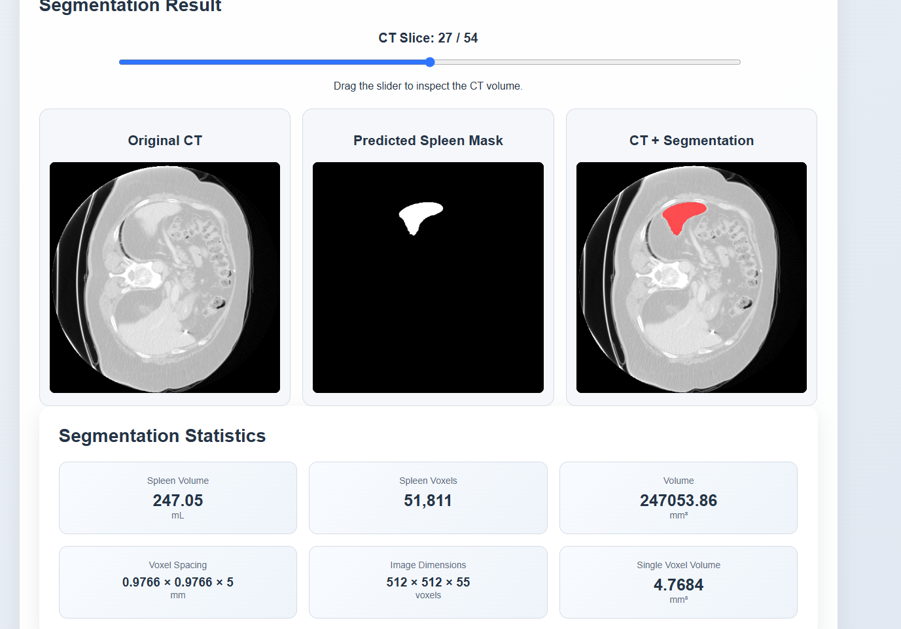
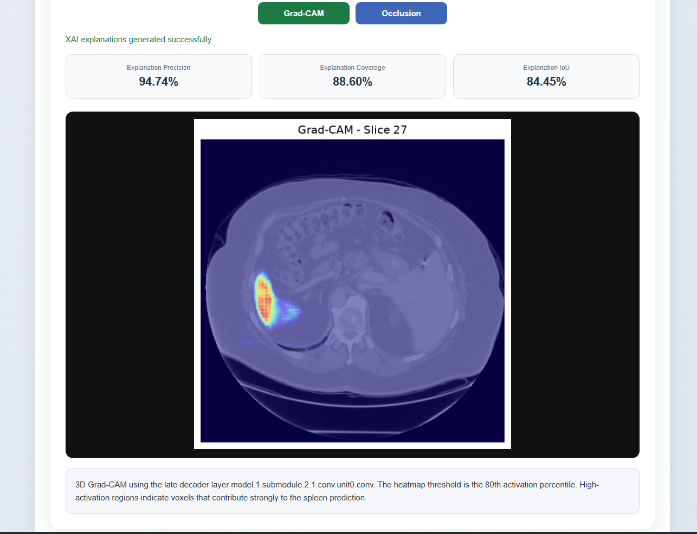
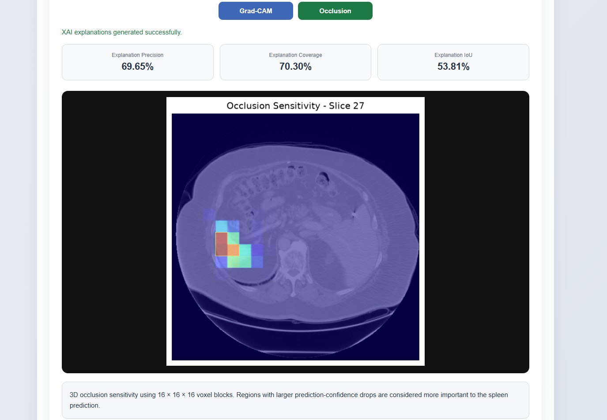
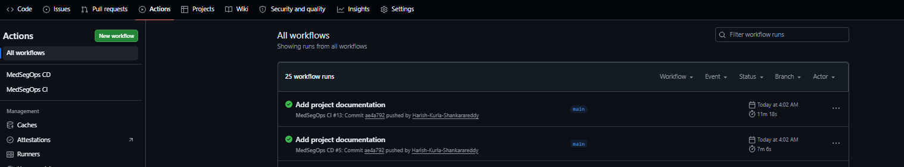

# MedSegOps

[](https://github.com/Harish-Kurla-Shankarareddy/MedSegOps/actions/workflows/ci.yml)
[](https://github.com/Harish-Kurla-Shankarareddy/MedSegOps/actions/workflows/cd.yml)

**Production-oriented medical image segmentation and MLOps pipeline for 3D spleen segmentation using MONAI, PyTorch, FastAPI, DICOM/DICOM SEG, Explainable AI, Docker, CI/CD, and automated model-quality validation.**

---

## Overview

MedSegOps is an end-to-end medical AI application for 3D spleen segmentation from CT images.

The project combines a MONAI/PyTorch segmentation model with the engineering required to build, evaluate, explain, test, secure, and deliver the application as a deployable service.

The system supports NIfTI and DICOM CT input, segmentation statistics, DICOM SEG export, Explainable AI, automated model-quality checks, Docker deployment, and GitHub Actions CI/CD.

> **Research and engineering project:** MedSegOps is not intended for clinical diagnosis, treatment, or direct patient care.

---

## Visual Demo

### 3D Spleen Segmentation

The application displays the original CT volume, predicted spleen mask, and segmentation overlay together with quantitative segmentation statistics.



### Explainable AI — 3D Grad-CAM

3D Grad-CAM highlights regions contributing to the spleen segmentation prediction.



### Explainable AI — Occlusion Sensitivity

3D occlusion sensitivity provides a complementary model explanation by measuring the effect of masking local regions of the input volume.



### CI/CD Pipeline

GitHub Actions automatically tests, validates, builds, scans, and delivers the application.



---

## Key Features

- 3D spleen segmentation with a MONAI UNet
- NIfTI (`.nii`, `.nii.gz`) input
- DICOM CT series input
- Binary DICOM SEG export
- Spleen volume and voxel statistics
- 3D Grad-CAM
- Occlusion sensitivity
- XAI alignment evaluation
- Dice and IoU evaluation
- Automated model regression quality gate
- FastAPI web interface and API
- Dockerized deployment
- Non-root container execution
- Docker health checks
- Trivy vulnerability scanning
- Git LFS model-weight management
- GitHub Actions CI/CD
- GitHub Container Registry delivery

---

## Architecture

```text
                    Medical CT Data
                          │
                 ┌────────┴────────┐
                 │                 │
               NIfTI             DICOM
                 │                 │
                 └────────┬────────┘
                          │
                          ▼
                  Preprocessing
                          │
                          ▼
                 MONAI 3D UNet
                          │
                          ▼
                  Spleen Segmentation
                          │
          ┌───────────────┼────────────────┐
          │               │                │
          ▼               ▼                ▼
      Statistics          XAI          DICOM SEG
                          │
                  ┌───────┴───────┐
                  │               │
              Grad-CAM        Occlusion
                  │               │
                  └───────┬───────┘
                          ▼
                   XAI Evaluation
                          │
                          ▼
                     FastAPI
                          │
                          ▼
                       Docker
                          │
                ┌─────────┴─────────┐
                │                   │
                ▼                   ▼
               CI                   CD
                │                   │
        Tests / Quality /       GHCR publish
        Docker / Trivy


## Medical AI Pipeline

MedSegOps uses a 3D MONAI UNet for spleen segmentation from CT volumes.

The inference pipeline performs:

1. Medical image loading
2. Orientation and spacing normalization
3. Intensity normalization
4. 3D sliding-window inference
5. Post-processing and inverse transformation
6. Binary spleen-mask generation

### Inference Configuration

| Parameter | Value |
|---|---|
| Spatial dimensions | 3D |
| Input channels | 1 |
| Output classes | 2 |
| Input spacing | 1.5 × 1.5 × 2.0 mm |
| Sliding-window ROI | 96 × 96 × 96 |
| Sliding-window batch size | 4 |
| Sliding-window overlap | 0.5 |

The model uses sliding-window inference to process 3D CT volumes while preserving the spatial context required for volumetric segmentation.

---

---

## Supported Medical Images

MedSegOps supports two primary medical imaging workflows.

### NIfTI

NIfTI volumes can be provided in the following formats:

```text
.nii
.nii.gz